  

  
  
  

<b>🇬🇧 English</b> · <a href="#turkce">🇹🇷 Türkçe</a>

### 👋 Hi, I'm Ramazan

**Backend & Full-Stack Developer.** I build production systems with Python/Django and own them end-to-end, from architecture to deployment.

`🏢 Multi-branch/multi-tenant` `⚡ Real-time (WebSocket)` `⚙️ Async (Celery/Redis)` `🗄️ Database performance` `🐳 Docker/Linux`

I'm currently solely responsible for the architecture, development, and deployment of four concurrent production systems at **Near East Technology**, alongside my own personal/freelance projects. My GitHub looks empty from the outside because most of it is **private** — here's a summary of what I've actually been building.

 

## 🛠️ Tech Stack

 

## 🌟 Flagship Projects

### Restaurant Management System

A platform I designed to run a multi-branch restaurant chain's order flow end-to-end, currently live in production. I unify orders coming from web, kiosk, and call-center channels into a single real-time stream, giving **7 different user roles** role-specific, instant updates.

`Django · Channels · Celery · Redis · MySQL · React · TypeScript · Docker`

Details

 

- 🔴 **Synchronization:** From the moment an order is placed until it's delivered, every status change (preparing → ready → on the way → delivered) is broadcast instantly to the relevant role over WebSocket — kitchen, courier, and customer screens stay in sync without a page refresh.
- 🏗️ **Architecture:** I built a layered (Clean) architecture split into Domain / Application / Infrastructure / Interface; business rules (services) are fully isolated from data access (repository implementations).
- 🔁 **Cross-branch operations:** I modeled order transfer as a first-class workflow across branches — an order can be instantly reassigned to another branch during capacity issues.
- 🔐 **Security by design:** A dedicated audit log for critical operations, XSS protection, and automatic secret rotation — built into the system from the start, not bolted on.
- ⚙️ **Async processing:** Work that shouldn't block the user, like notifications, runs in the background via Celery; Redis serves as both the cache and the WebSocket messaging layer.

 

### Ramot — Algorithmic Trading Platform

A multi-tenant platform where each user connects their own exchange account, running automated trading bots on Binance (crypto) and XAUUSDT (gold). I integrated the Anthropic API for trade-signal confidence scoring, making risk/leverage decisions data-driven.

`Django REST + Channels · Celery · Redis · PostgreSQL · React · TypeScript · Anthropic API`

Details

 

- 🤖 **Two independent bots:** CryptoBot runs every 60 seconds, GoldBot every 5 minutes — each on its own cycle, scheduled separately via Celery beat.
- 🧠 **AI-assisted signal scoring:** I feed RSI/MACD/Bollinger/ATR-based signals through the Anthropic API for confidence scoring, which directly drives position sizing and leverage decisions.
- 🛡️ **Automated risk management:** Trailing stops, liquidation guards, daily loss and max-drawdown limits; the gold bot adds session (London/NY/Asia) and ADX filters.
- 🔴 **Real-time dashboard:** I stream live positions and price ticks to the React frontend over WebSocket via Django Channels.
- 🔐 **Per-user security:** Each user's exchange API keys are stored encrypted in the database, protected by JWT + 2FA.
- ✅ Validated end-to-end through live trading across several independently connected accounts, alongside extensive backtesting.

 

## 🔒 Other Projects

Beyond these, here are the highlights from the 9 private repos I actively work on:

| Project | Description | Tech | Status |
|---|---|---|---|
| **Multi-Tenant ERP for Craft Manufacturers** | A SaaS I built for small-scale craft manufacturers to manage materials, products, sales, and tasks. I built a layered Clean Architecture, JWT auth, and tenant isolation. | Django REST Framework · React · JWT | 🟢 Active |
| **SaaS Starter Kit** | A reusable Django + React/TS starter kit (auth, Docker, base project scaffold) I built for multi-tenant SaaS products. | Django · React (TS) · Docker | 🟡 Maintenance |
| **Corporate Website — Automotive Tire Industry** | A corporate site with a management panel I built for an automotive tire company. | Django · React (TS) | ✅ Delivered |
| **Corporate Website — Metal Industry** | A Django-based corporate website I built for a metal industry company. | Django · HTML/CSS · JavaScript | ✅ Delivered |
| **Personal Portfolio** | My own Django-based portfolio site, deployed to production with Nginx + systemd. | Django · Nginx · Shell | 🟢 Active |
| **100 Days of Python** | My Jupyter Notebook-based practice notebooks for reinforcing Python fundamentals. | Python · Jupyter Notebook | 📚 Learning |
| **Python Exercises** | My basic Python practice scripts (conditionals, loops, logical operators, small apps). | Python | 📚 Learning |

 

## 📫 Contact

📧 [rkarsanba0@gmail.com](mailto:rkarsanba0@gmail.com) · 💼 [LinkedIn](https://linkedin.com/in/ramazan-karsanba) · 🌐 [ramazankarsanba.com](https://ramazankarsanba.com)

  

---

<a href="#english">🇬🇧 English</a> · <b>🇹🇷 Türkçe</b>

### 👋 Merhaba, ben Ramazan

**Backend & Full-Stack Developer.** Python/Django ile production sistemler geliştiriyor ve mimariden deploy'a kadar tek başıma işletiyorum.

`🏢 Multi-branch/multi-tenant` `⚡ Gerçek zamanlı (WebSocket)` `⚙️ Asenkron (Celery/Redis)` `🗄️ Veritabanı performansı` `🐳 Docker/Linux`

Şu anda **Near East Technology**'de dört eşzamanlı production sisteminden tek başıma sorumluyum; bunun yanında kendi kişisel/freelance projelerimi yürütüyorum. GitHub profilim çoğunlukla **private repo** içerdiği için dışarıdan boş görünüyor — aşağıda ne üzerinde çalıştığımın özeti var.

 

## 🛠️ Teknolojiler

 

## 🌟 Bayrak Projeler

### Restoran Yönetim Sistemi

Çoklu şubeli bir restoran zincirinin sipariş akışını uçtan uca yönetmek için tasarladığım, canlı ortamda kullanılan bir platform. Web, kiosk ve call-center kanallarından gelen siparişleri tek bir gerçek zamanlı akışta birleştirip **7 farklı kullanıcı rolüne** role özel, anlık bilgi akışı sağlıyorum.

`Django · Channels · Celery · Redis · MySQL · React · TypeScript · Docker`

Detaylar

 

- 🔴 **Senkronizasyon:** Sipariş oluşturulduğu andan teslim edilene kadar her durum değişikliğini (hazırlanıyor → hazır → yolda → teslim edildi) WebSocket üzerinden ilgili role anında yayınlıyorum — sayfa yenilemeye gerek kalmadan mutfak, kurye ve müşteri ekranları senkron kalıyor.
- 🏗️ **Mimari:** Domain / Application / Infrastructure / Interface olarak katmanlı (Clean) bir mimari kurdum; iş kurallarını (services) veri erişiminden (repository implementasyonları) tamamen izole ettim.
- 🔁 **Şubeler arası operasyon:** Sipariş transferini şubeler arası birinci sınıf bir iş akışı olarak modelledim; yoğunluk/kapasite durumunda sipariş başka bir şubeye anlık devredilebiliyor.
- 🔐 **İleriye dönük güvenlik:** Kritik operasyonlar için ayrı bir denetim (audit) günlüğü, XSS koruması ve otomatik secret rotation altyapısı kurdum.
- ⚙️ **Asenkron işleyiş:** Bildirim gibi kullanıcıyı bekletmemesi gereken işleri Celery ile arka planda çalıştırıyorum; Redis'i hem cache hem WebSocket mesajlaşma katmanı olarak kullanıyorum.

 

### Ramot — Algoritmik Trading Platformu

Her kullanıcının kendi borsa hesabını bağladığı, Binance (kripto) ve XAUUSDT (altın) üzerinde otomatik trading botları çalıştırdığım multi-tenant bir platform. Sinyal güven skorlaması için Anthropic API'yi entegre ederek risk/kaldıraç kararlarını veriye dayalı hale getirdim.

`Django REST + Channels · Celery · Redis · PostgreSQL · React · TypeScript · Anthropic API`

Detaylar

 

- 🤖 **İki bağımsız bot:** CryptoBot 60 saniyede, GoldBot 5 dakikada bir kendi döngüsünde çalışıyor; Celery beat ile ayrı ayrı zamanlanıyor.
- 🧠 **AI destekli sinyal skorlama:** RSI/MACD/Bollinger/ATR tabanlı sinyalleri Anthropic API ile güven skoruna çeviriyorum; bu skor doğrudan pozisyon büyüklüğü/kaldıraç kararını besliyor.
- 🛡️ **Otomatik risk yönetimi:** Trailing stop, likidasyon koruması, günlük zarar ve maksimum drawdown limitleri; altın botunda ayrıca seans (Londra/NY/Asya) ve ADX filtreleri.
- 🔴 **Gerçek zamanlı dashboard:** Django Channels üzerinden canlı pozisyon ve fiyat akışını React arayüzüne WebSocket ile taşıyorum.
- 🔐 **Kullanıcı bazlı güvenlik:** Her kullanıcının borsa API anahtarları veritabanında şifreli tutuluyor; JWT + 2FA ile korunuyor.
- ✅ Birden fazla bağımsız hesapta canlı trading ile uçtan uca doğruladım, kapsamlı backtesting ile destekledim.

 

## 🔒 Diğer Projeler

Bunların dışında üzerinde çalıştığım 9 private repo'dan öne çıkanlar:

| Proje | Açıklama | Teknolojiler | Durum |
|---|---|---|---|
| **El İşi Üreticileri için Multi-Tenant ERP** | Küçük ölçekli el işi üreticileri için malzeme, ürün, satış ve görev yönetimi sağlayan bir SaaS geliştirdim. Clean Architecture ile katmanlı bir mimari kurdum, JWT auth ve tenant izolasyonu ekledim. | Django REST Framework · React · JWT | 🟢 Aktif |
| **SaaS Starter Kit** | Multi-tenant SaaS ürünlerinde tekrar kullanmak üzere bir Django + React/TS başlangıç altyapısı (auth, Docker, temel proje iskeleti) geliştirdim. | Django · React (TS) · Docker | 🟡 Bakımda |
| **Kurumsal Web Sitesi — Oto Lastik Sektörü** | Bir oto lastik firması için kurumsal tanıtım ve yönetim paneli içeren bir web sitesi geliştirdim. | Django · React (TS) | ✅ Teslim edildi |
| **Kurumsal Web Sitesi — Metal Sektörü** | Bir metal sektörü firması için Django tabanlı bir kurumsal web sitesi geliştirdim. | Django · HTML/CSS · JavaScript | ✅ Teslim edildi |
| **Kişisel Portfolyo** | Kendi Django tabanlı portfolyo sitemi Nginx + systemd servisiyle production'a aldım. | Django · Nginx · Shell | 🟢 Aktif |
| **100 Days of Python** | Python temellerimi pekiştirmek için hazırladığım Jupyter Notebook tabanlı alıştırma/çalışma defterlerim. | Python · Jupyter Notebook | 📚 Öğrenme |
| **Python Alıştırmaları** | Temel Python pratik scriptlerim (koşullar, döngüler, mantıksal operatörler, küçük uygulamalar). | Python | 📚 Öğrenme |

 

## 📫 İletişim

📧 [rkarsanba0@gmail.com](mailto:rkarsanba0@gmail.com) · 💼 [LinkedIn](https://linkedin.com/in/ramazan-karsanba) · 🌐 [ramazankarsanba.com](https://ramazankarsanba.com)
